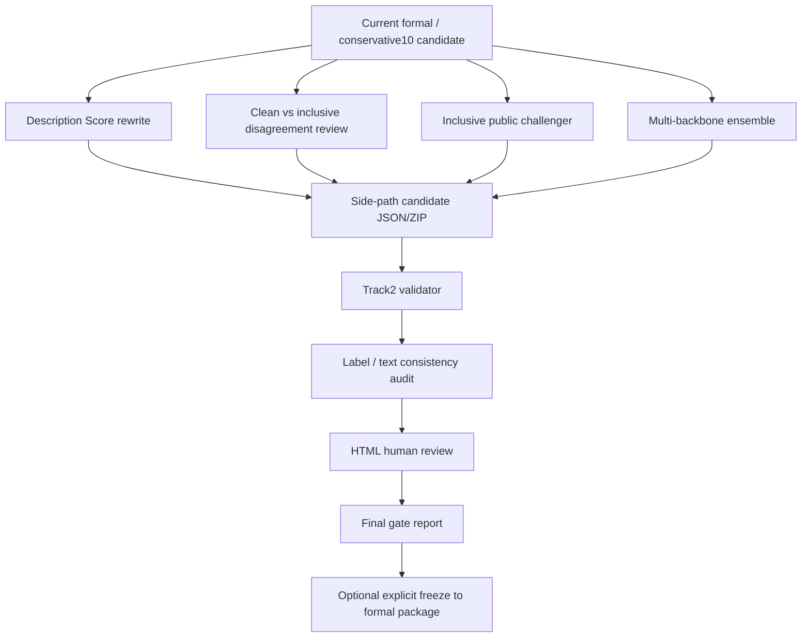

# Track2 Final Push Design

## Summary

This design defines the final Track2 improvement workflow for AffectiveArt Challenge 2026. It is Track2-only and does not modify Track1 files or overwrite the formal Track2 submission package unless the user explicitly approves a freeze step.

The goal is to improve both halves of the official Track2 score:

- Classification score: 12-way emotion, binary valence, binary arousal.
- Description Score: artwork consistency, attribute analysis quality, overall caption quality.

Because official test labels are hidden, every candidate must be produced as a side-path artifact, reviewed, and validated before it can be considered for final submission.

## Current Baseline

Formal package remains unchanged:

- `submissions/track2_submission.json`
- `submissions/track2_submission.zip`

Current recommended challenger:

- `submissions/track2_submission_public_style_conservative10_candidate.json`
- `submissions/track2_submission_public_style_conservative10_candidate.zip`

This challenger changes 10 rows, all `content -> calm`, with `emotional_valence=Positive` and `emotional_arousal_level=Low` unchanged.

## Architecture

The final push has four independent workstreams. They share the same validation and final-gate layer.



No workstream may write directly to `submissions/track2_submission.json` or `submissions/track2_submission.zip`.

## Workstream A: Description Score Optimization

### Purpose

Improve the 50% Description Score without changing classification labels.

### Input

Preferred input:

- `submissions/track2_submission_public_style_conservative10_candidate.json`

Fallback input:

- `submissions/track2_submission.json`

### Fields Allowed To Change

- `overall_caption`
- `brushstroke`
- `composition`
- `color`
- `line`
- `light`

### Fields Not Allowed To Change

- `sample_id`
- `emotion`
- `emotional_valence`
- `emotional_arousal_level`

### Method

Use Gemini 3.5 Flash and Vulca/vulca-emnlp as reviewers and text repair aids. The rewrite should be text-only and conservative:

- Improve artwork-specific visual grounding.
- Make each attribute field more concrete.
- Keep the emotional reading aligned with the existing label.
- Remove generic template language.
- Avoid evaluator-directed instructions or score manipulation.

### Output

Side-path candidate:

- `submissions/track2_submission_desc_rewrite_candidate.json`
- `submissions/track2_submission_desc_rewrite_candidate.zip`

Audit artifacts:

- `experiments/track2_final_push_20260603/description_rewrite/description_audit_before.json`
- `experiments/track2_final_push_20260603/description_rewrite/description_audit_after.json`
- `experiments/track2_final_push_20260603/description_rewrite/html_review/track2_description_review.html`

### Gate

The candidate can advance only if:

- `python3 -m affectiveart.challenge validate-track2 <candidate.json>` passes.
- Emotion/valence/arousal are byte-for-byte unchanged from the input candidate.
- No text field contains evaluator manipulation, hidden instructions, or invalid task responses.
- Sampled HTML review shows improved or unchanged image-text consistency.
- Vulca/Gemini audit does not find systematic caption/attribute drift.
- Any row flagged as hallucinated, image-inconsistent, or emotionally contradictory is rolled back to the input text.
- Pilot pass covers at least 32 high-risk rows before any full rewrite is considered.
- Full rewrite can advance only if the audit shows zero evaluator-manipulation issues and no net increase in image-text inconsistency on the reviewed sample.

## Workstream B: Clean vs Inclusive Disagreement Review

### Purpose

Review the model disagreement cases where public-style inclusive training may reveal useful label repairs.

### Input

Existing public-style outputs:

- `experiments/track2_public_style_distillation_20260603/siglip2_cached_logreg_v1/clean_predictions.json`
- `experiments/track2_public_style_distillation_20260603/siglip2_cached_logreg_v1/inclusive_predictions.json`
- `experiments/track2_public_style_distillation_20260603/siglip2_cached_logreg_v1/clean_vs_inclusive_report.json`

### Scope

Primary review set:

- 56 clean/inclusive disagreement samples.
- Especially the 24 inclusive-only changes.

Priority transitions:

- `content -> calm`
- `calm -> content`
- `calm/content/glad` boundary cases.
- `frustrated/aroused` boundary cases.

### Method

Generate an HTML review packet with:

- Test image.
- Current label and VA.
- Clean prediction with confidence, margin, kNN top3.
- Inclusive prediction with confidence, margin, kNN top3.
- High-similarity reference flag.
- Manual decision field: `keep_current`, `accept_clean`, `accept_inclusive`, `hold`.
- Short reviewer rationale.

Human review SOP:

- Use `keep_current` when neither model prediction is visually obvious.
- Use `accept_clean` only when the clean prediction is visually supported and inclusive is noisy or over-corrected.
- Use `accept_inclusive` only when the inclusive prediction is visually supported, VA remains coherent, and the change is not explained only by public-style prior.
- Use `hold` when the sample is ambiguous, abstract, stylistically unusual, or likely to reduce Description Score coherence.
- For `calm/content`, prefer `calm` for quiet, low-action, contemplative scenes; prefer `content` for satisfied, warm, materially pleasant, or socially fulfilled scenes.
- For `frustrated/aroused`, prefer `frustrated` when the negative obstruction/tension is clear; prefer `aroused` only for high-energy activation without clear negative valence.

### Output

Review artifacts:

- `experiments/track2_final_push_20260603/clean_inclusive_disagreement/html_review/track2_clean_inclusive_disagreement_review.html`
- `experiments/track2_final_push_20260603/clean_inclusive_disagreement/track2_clean_inclusive_disagreement_decisions.csv`

Candidate, only after decisions are filled:

- `submissions/track2_submission_clean_inclusive_review_candidate.json`
- `submissions/track2_submission_clean_inclusive_review_candidate.zip`

### Gate

The candidate can advance only if:

- Manual decision explicitly approves every changed row.
- VA remains consistent with the selected emotion.
- No high-risk negative/high-arousal flip is accepted without human rationale.
- Missing emotions remain none.
- Top emotion share does not indicate worse category collapse.
- Validator passes.
- At least one reviewer rationale is present for every accepted row.
- If multiple reviewers are used, disagreement rows remain `hold` unless adjudicated explicitly.

## Workstream C: Full Public Inclusive Challenger

### Purpose

Since manual review found that many high-similarity public references are not exact duplicate images, test a full-public inclusive challenger instead of treating inclusive as diagnostic-only.

### Method

Use the existing cached SigLIP2 public-style method:

- Frozen SigLIP2 embeddings.
- Class-balanced Logistic Regression.
- kNN evidence.
- No exclusion of high-similarity public request IDs.

The inclusive model remains a proposer, not an automatic submission generator.

Rollout is phased:

1. Generate proposal table only, no candidate.
2. Review inclusive-only changes and high-similarity flagged rows.
3. Build a candidate only from explicitly approved rows.
4. Compare candidate distribution against the conservative baseline before validation.

### Output

Side-path candidate:

- `submissions/track2_submission_inclusive_public_challenger_candidate.json`
- `submissions/track2_submission_inclusive_public_challenger_candidate.zip`

Analysis artifacts:

- `experiments/track2_final_push_20260603/inclusive_public_challenger/inclusive_challenger_report.json`
- `experiments/track2_final_push_20260603/inclusive_public_challenger/inclusive_challenger_report.md`
- `experiments/track2_final_push_20260603/inclusive_public_challenger/html_review/track2_inclusive_challenger_review.html`

### Gate

A row may be accepted only if:

- Inclusive confidence is high enough.
- Inclusive margin is high enough.
- kNN agrees with classifier prediction.
- VA can be repaired or preserved without contradiction.
- Text fields remain consistent after repair.
- The row is not a broad low-confidence category drift.
- The change does not rely solely on a public-style prior such as "traditional Chinese painting usually equals calm".
- The sample is not from a long-tail style where the inclusive model shows weak local neighbor support.

Suggested starting thresholds:

- `confidence >= 0.70`
- `margin >= 0.12`
- `knn_confidence >= 0.55`

High-similarity public references should be marked as `high_similarity_but_not_duplicate`, not automatically blocked. They still require explicit review if they change labels.

Distribution guard:

- `calm` top emotion share must not increase by more than 2 percentage points over the conservative baseline without manual justification.
- `content` count must not drop by more than 20 rows without manual justification.
- No emotion class present in the conservative baseline may fall to zero.

## Workstream D: Multi-Backbone Selective Fusion

### Purpose

Avoid overreliance on one embedding space. Use multiple sources only when they provide robust, complementary evidence.

### Candidate Sources

- SigLIP2 cached logreg/kNN.
- DINOv2 cached classifier.
- CLIP cached classifier.
- Gemini hard-case reviewer.
- Future fine-tuned image head if it passes validation gates.

### Method

Build a selective fusion table with one row per sample:

- Current label.
- Each model source prediction.
- Per-source confidence and margin.
- kNN or neighbor support where available.
- Proposed fused label.
- Reason code.

Only accept a fused change when one of these holds:

- Multiple independent models agree on the same correction.
- The change rescues a minority class without damaging VA consistency.
- Human review approves a hard case with supporting model evidence.

### Output

Candidate:

- `submissions/track2_submission_multibackbone_fusion_candidate.json`
- `submissions/track2_submission_multibackbone_fusion_candidate.zip`

Review artifacts:

- `experiments/track2_final_push_20260603/multibackbone_fusion/fusion_scoreboard.json`
- `experiments/track2_final_push_20260603/multibackbone_fusion/fusion_scoreboard.md`
- `experiments/track2_final_push_20260603/multibackbone_fusion/html_review/track2_multibackbone_review.html`

### Gate

The candidate can advance only if:

- It beats the conservative baseline on public/hard-case proxy metrics.
- It does not introduce new label consistency issues.
- It does not collapse minority classes.
- It passes human review for all changed high-risk rows.
- Any model source with known leakage, style-prior, or label-collapse behavior is allowed only as weak evidence, not as a sole decision maker.
- Fusion must emit a reason code for every accepted change.

## Execution Order

1. Implement Workstream A first because it can improve Description Score without touching labels.
2. Implement Workstream B next because it converts the current clean/inclusive gap into a reviewable decision packet.
3. Implement Workstream C after B, using inclusive as a challenger with explicit gate.
4. Implement Workstream D last, after source predictions and local proxy metrics are available.

## Validation Commands

Run Track2-only checks:

```bash
python3 -m unittest discover -s tests -p 'test_track2*.py' -v
python3 -m affectiveart.challenge validate-track2 <candidate.json>
git diff --check
```

Do not run full Track1+Track2 discovery as a release gate in this Track2-only session.

## Phased Rollout

Each workstream must pass through these stages:

1. `proposal`: model or rewrite proposals are generated with no candidate JSON.
2. `pilot_review`: a small high-risk sample is rendered to HTML and reviewed.
3. `candidate`: only approved rows are written to side-path JSON/ZIP.
4. `final_gate`: validator, consistency audit, distribution audit, and review report are complete.
5. `freeze`: formal package is overwritten only after explicit user approval.

## Decision Policy

No candidate becomes the formal submission unless the user explicitly approves one of these actions:

- Freeze conservative10 as formal.
- Freeze description-rewrite candidate as formal.
- Freeze clean/inclusive reviewed candidate as formal.
- Freeze inclusive public challenger as formal.
- Freeze multibackbone fusion candidate as formal.

Until that approval, all outputs remain side-path artifacts.

## Open Risks

- Hidden official labels are unavailable, so local proxy gains may not transfer.
- Inclusive public training may over-amplify public label priors, especially `content -> calm`.
- Description rewrites can hurt score if they become generic, hallucinated, or inconsistent with images.
- Multi-backbone fusion can look stronger locally while increasing category collapse.

## Recommended First Implementation Plan

The first implementation plan should cover only two deliverables:

1. Description Score text-only rewrite candidate.
2. Clean/inclusive disagreement HTML review packet.

The inclusive challenger and multibackbone fusion should remain follow-up plans after the first two deliverables are reviewed.
