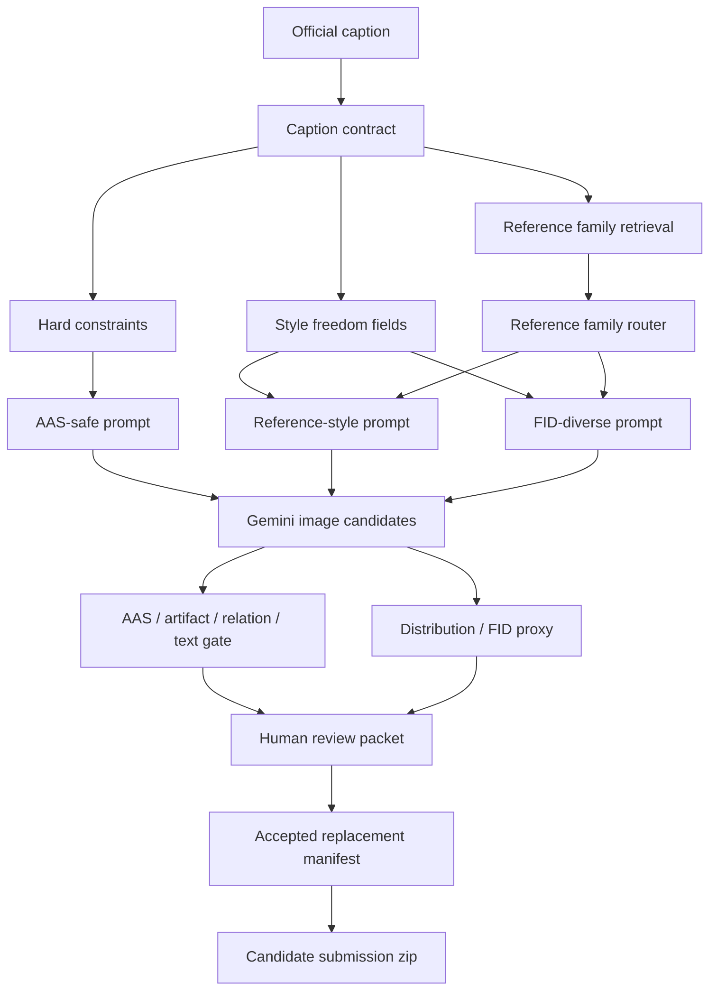

# Track1 Reference Distribution Anti-Template Design

## Executive Summary

Track1 现在最危险的问题不是单张图片的 caption fidelity，而是生成分布正在向统一模板坍缩。当前 MoE Top28 的 93 个候选里，90 个是 `portrait_poster`，93/93 prompt 含 `front-facing`，90/93 含 `flat printed poster` 和 `portrait poster canvas`。相反，Top28 reference viewer 中的 31 个 reference assets 是 16 个 landscape、10 个 portrait、5 个 square-ish。

这意味着：我们的 pipeline 正在用硬 prompt 保护 AAS，但同时把 FID 需要的艺术分布多样性压扁。官方 Track1 是 50% FID + 50% AAS；因此“更像统一海报模板”不是小审美问题，而是冲奖风险。

结论：下一步要把 Vulca/Gemini pipeline 从“约束编译器”升级成“约束 + reference distribution + 多候选选择器”。特化 prompt 用来守 AAS 底线，controlled freedom 用来冲 FID 上限。

## Ground Truth And Current Evidence

### Official Rule Surface

Track1 要为每个 caption 生成一张艺术图像。官方评价由 FID 和 AAS 各占 50%。AAS 分为 content alignment、style alignment、attribute alignment；attribute 覆盖 composition、brushwork、color、line、lighting 等视觉属性。官方还明确 invalid submissions 包括无效结构、缺失 sample、评估器操纵文本等。

我们不能用公共榜单账号推断自己的成绩。到目前为止，本项目本地没有 Track1 Codabench 上传记录；本地 zip 包只是 candidate packages，不是官方 score。

### Local Template-Collapse Evidence

MoE Top28 generated candidates:

- total candidates: 93
- dimensions:
  - 90 x `(768, 1024, portrait_poster)`
  - 3 x `(682, 1024, vertical_scroll)`
- prompt phrase frequency:
  - `front-facing`: 93/93
  - `flat printed poster`: 90/93
  - `portrait poster canvas`: 90/93
  - `medium-distance figures`: 90/93
  - `graphic poster composition`: 90/93
  - `Use fewer, larger...`: 90/93
  - `internal poster margins`: 90/93

Reference assets in the current viewer:

- total reference assets: 31
- aspect mix:
  - landscape: 16
  - portrait: 10
  - square-ish: 5

Interpretation:

- The generated set is structurally much narrower than the retrieved reference set.
- The prompt compiler is not only asking for poster surfaces; it is repeatedly imposing the same camera/surface/composition grammar.
- This can help AAS in obvious object/text cases, but it risks FID because FID sees distribution-level mismatch.

## Why The References Look More Artistic

The references are not merely "better posters". They differ on multiple distribution dimensions:

- Aspect: many references are landscape or near-square, not fixed vertical poster.
- Composition: references include crowds, deep scenes, diagonals, close-up figures, wide battle panoramas, institutional scenes, sparse symbolic scenes, and dense narrative scenes.
- Medium: references mix painting, print, illustration, poster, scan-like texture, washed paper, grain, aging, and brushwork.
- Boundary: real artwork often has natural crop, irregular margins, print aging, and surface texture. Our prompt often produces a clean modern generated poster surface.
- Figure scale: reference figures vary from tiny crowds to full-body heroes to architectural-dominant scenes. Our candidates frequently converge to medium-distance central heroic figures.
- Text behavior: reference text may be bold, sparse, integrated, or partially absent depending on artwork type. Our candidates tend to force large poster typography even when the style family could be broader.

Official AAS still requires caption alignment. The lesson is not to make images random or remove poster features. The lesson is to avoid converting every `poster` or `Socialist Realism` caption into the same front-facing portrait template.

## Public Signals About Strong-Team Methods

We do not know private team pipelines. The following is inference from public benchmark rules, public leaderboard behavior, and adjacent text-to-image research.

### Public Leaderboard Signal

The public Codabench leaderboard shows top submissions with AAS around 0.99 and much better FID than weaker submissions. This implies competitive systems are not trading AAS away for visual freedom. They likely maintain high prompt alignment while fitting reference distribution better.

### Official Baseline Signal

The AffectiveArt challenge proposal describes a FLUX.1-dev + LoRA style baseline using style-specific examples. That is a signal that distribution adaptation matters; pure prompt engineering against a generic image model is not expected to be the strongest approach.

### Adjacent Research Signal

Relevant public methods point in the same direction:

- Re-Imagen: retrieval-augmented text-to-image generation for rare or unseen entities.
- FineRAG: fine-grained retrieval to reduce retrieval noise in complex/open-world T2I.
- ImageRAG / IA-T2I: active or dynamic reference retrieval when prompts require external visual knowledge.
- AR-RAG: retrieval at finer visual granularity to avoid static one-shot reference limitations.
- MultiRef: multi-reference conditioning is hard but important; ordering and attribute binding matter.
- InstanceGen and modern T2I benchmarks: object attributes, counts, spatial relations, and instance-level instructions must be explicitly evaluated.
- NTIRE/T2I quality-assessment work: generator quality needs multi-dimensional evaluation, not only one CLIP-like score.

### Strong-Team Stack Inference

Likely strong approaches are some combination of:

- Strong base generator: FLUX/SDXL/Imagen/Gemini-class image model.
- Style distribution adaptation: LoRA, style reference conditioning, or large reference-conditioned prompt bank.
- Retrieval layer: caption-to-reference matching over EmoArt-style data or external factual images for landmarks/flags/medals.
- Multi-candidate generation: several routes per sample, not one prompt per sample.
- Automated gate: VLM/AAS proxy, OCR/text-risk checks, relation/physics checks, image quality checks.
- Distribution gate: FID proxy, style family balance, aspect ratio balance, image embedding diversity.
- Human final gate: especially for relation semantics, artifacts, text, and real-world symbols.

Because we are using Gemini API as the final generator, we cannot directly control denoising, ControlNet, IP-Adapter, or LoRA at generation time. Therefore our competitive advantage must come from the upstream and downstream system: retrieval, prompt compilation, candidate diversity, and final selection.

## Design Direction

### Principle

Use hard constraints only where the caption requires them. Use reference-conditioned freedom everywhere else.

Hard constraints protect AAS:

- caption main content;
- required support/surface: poster, scroll, album, graph paper, folded paper;
- named symbols: flags, medals, buildings, uniforms, documents;
- text policy: requested Cyrillic/calligraphy/seals only, no sample IDs/watermarks;
- spatial/relation logic: train windows, soldiers/civilians, tanks/soldiers, hands/documents, aircraft/flags;
- artifact boundary: no gallery/mockup/catalog/display unless explicitly requested.

Style freedom protects FID:

- aspect ratio when not explicitly fixed;
- crop and viewpoint;
- figure scale;
- density and depth;
- border/margin treatment;
- medium: oil, watercolor, lithograph, print, scan, paper aging, poster paint;
- brushwork, line, lighting, color treatment;
- degree of typography dominance.

## Proposed Pipeline

### Candidate Strategies

Each target sample should receive three routes:

1. `AAS-safe`
   - More conservative.
   - Uses current content-lock strengths.
   - Good for samples with difficult relation/text/entity requirements.

2. `reference-style`
   - Uses nearest EmoArt/reference family as style and composition anchor.
   - Keeps hard constraints but asks Gemini to match medium, crop, density, lighting, and texture.
   - This is likely the main FID improvement route.

3. `FID-diverse`
   - Removes unnecessary front-facing/poster-template language.
   - Preserves only hard constraints.
   - Explores alternate aspect, crop, scene density, and medium.
   - Used as a challenger, not automatic replacement.

### Reference Family Router

Replace coarse `poster_expert` with broader visual families:

- Kremlin / Red Square / searchlight night scene
- battle / tank / cavalry / infantry action scene
- naval / aviation / vehicle propaganda
- surrender / treaty / institutional document tableau
- agriculture / industrial worker realism
- medal / anniversary / commemorative symbolic scene
- scroll / album / graph-paper / paper-support artwork
- generic painting / watercolor / oil / print surface when caption is not poster-bound

The router should output:

- `family_id`
- `aspect_options`
- `medium_options`
- `composition_options`
- `text_policy`
- `reference_assets`
- `risk_tags`
- `hard_constraints`
- `freedom_budget`

### Prompt Lint

Before generation, batch prompt packets must pass a template-collapse lint:

- fail or warn if more than 60% of prompts contain the same global composition phrase;
- specifically watch:
  - `front-facing`
  - `portrait poster canvas`
  - `flat printed poster`
  - `medium-distance figures`
  - `fewer, larger text blocks`
  - `internal poster margins`
- require justification if a high-frequency phrase is retained because caption/support demands it.

### Distribution Proxy

The proxy is not an official score. It is a candidate-ranking and risk tool.

Suggested dimensions:

- aspect ratio distribution vs reference bank;
- mean color / contrast / edge density;
- image embedding diversity with SigLIP/CLIP/DINO if available;
- nearest-reference family match;
- repeated composition risk;
- percentage of generated candidates with visible typography when caption does not require it;
- percentage of generated candidates with poster borders/margins;
- local FID-like sanity check against selected EmoArt reference subsets.

## Submission Strategy

Because we have not submitted yet, first use one official submission as calibration. The submission budget is valuable, but official feedback is much more reliable than any local proxy.

Recommended sequence:

1. Submit a conservative validated package to get real official FID/AAS.
2. Implement anti-template reference-family pipeline.
3. Run Top28 rerun with the three candidate strategies.
4. Expand to 100 samples only after Top28 shows visible diversity without AAS collapse.
5. Expand to 1000 with prefiltering.
6. Submit high-precision packages only after human gate.

Candidate official submission slots:

- Submission 1: safest current package, for calibration.
- Submission 2: anti-template Top100 high-precision package.
- Submission 3: reference-family full high-precision package.
- Submission 4: FID-diverse balanced package.
- Submission 5: final human-gated champion.

## Immediate Implementation Plan Draft

This section is not a full Superpowers implementation plan yet. It defines the next design scope.

1. Build `track1_reference_family_bank`.
   - Input: EmoArt-130k/5k reference images and metadata.
   - Output: compact families with representative images, aspect distribution, medium/composition notes.

2. Build `track1_distribution_router`.
   - Input: official caption + current contract.
   - Output: hard constraints, style freedom, reference family, candidate strategy plan.

3. Modify MoE prompt packet builder.
   - Generate `AAS-safe`, `reference-style`, and `FID-diverse` packets.
   - Keep route metadata out of provider prompts.
   - Remove global front-facing/portrait poster defaults unless required.

4. Add prompt-template lint.
   - Run before generation.
   - Block or warn on phrase collapse.

5. Add distribution proxy report.
   - Run after generation.
   - Output JSON/CSV/MD and HTML viewer annotations.

6. Generate Top28 rerun.
   - Do not touch champion submission.
   - Produce review HTML with current, best old candidate, three new strategies, and reference family panel.

7. Human gate.
   - Accept only clear wins.
   - Hold any case where freedom improves style but loses content/support/text/relation.

## Risks

- Over-freeing prompts can lower AAS if caption objects or support are lost.
- Over-specializing prompts can preserve AAS but keep FID too high.
- Gemini may ignore subtle style-family instructions without image references.
- Reference assets can be partial matches; using them as exact content references can hallucinate wrong objects.
- Human review does not scale to 1000 unless AI prefilter and review packet are well designed.
- Public leaderboard scores are not our scores unless submitted under our account.

## Decision

Proceed with controlled freedom:

- hard constraints are mandatory;
- visual family and reference distribution drive style;
- three candidate strategies are generated per selected sample;
- prompt-template lint prevents batch-level collapse;
- distribution proxy helps rank candidates;
- human gate remains final before any package replacement.

## Sources

- Codabench Track1 competition page and evaluation description: https://www.codabench.org/competitions/16299/
- AffectiveArt Challenge 2026 proposal / baseline discussion: https://openreview.net/pdf?id=LbbHX8ofXZ
- Re-Imagen retrieval-augmented T2I: https://arxiv.org/abs/2209.14491
- FineRAG: https://aclanthology.org/2025.coling-main.741/
- ImageRAG: https://arxiv.org/abs/2502.09411
- IA-T2I: https://arxiv.org/abs/2505.15779
- MultiRef: https://multiref.github.io/
- InstanceGen: https://tau-vailab.github.io/InstanceGen/
- NTIRE 2025 T2I quality assessment: https://arxiv.org/abs/2505.16314
