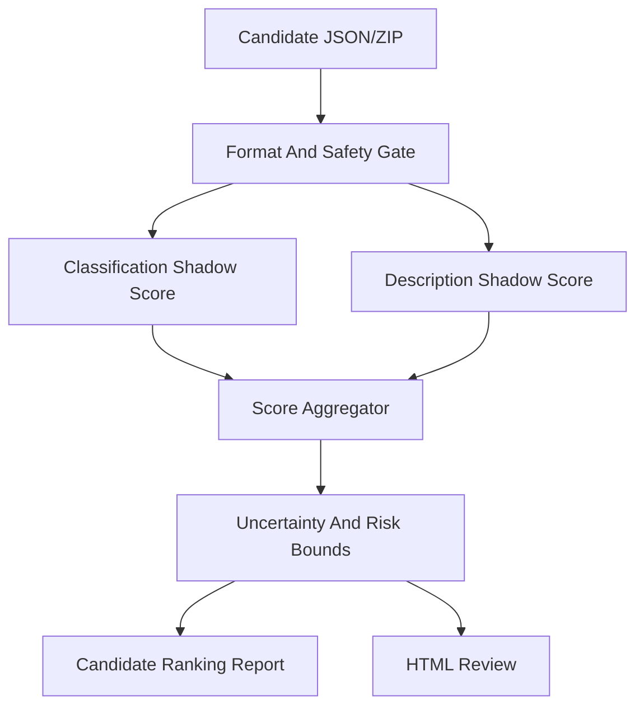

# Track2 Local Shadow Evaluator Design

**Date:** 2026-06-05

## Summary

This design defines an independent Track2 local scoring project for AffectiveArt Challenge 2026. Its purpose is to rank candidate submissions offline before spending scarce Codabench submissions.

The tool is a shadow evaluator, not a reverse-engineered official evaluator. It reproduces the public scoring formula where possible, estimates hidden-test classification risk with local evidence, estimates Description Score with multimodal judges, and reports uncertainty. A local score above the visible leaderboard leader is a readiness signal, not proof that the official hidden score will exceed the leader.

## Goal

Build a Track2-only, side-effect-free local evaluator that can score and compare any candidate JSON/ZIP against:

- the current official feedback from our submitted package;
- public validation and public-style label evidence;
- human, Gemini 3.5, Vulca, and duplicate/same-series evidence;
- local Description Score audits;
- distribution and consistency risk gates.

The evaluator should be reusable and upgradeable as new Codabench feedback arrives.

## Non-Goals

- Do not attempt to reconstruct hidden gold labels.
- Do not probe, exploit, or manipulate Codabench or the official evaluator.
- Do not include evaluator-directed instructions in submission text.
- Do not submit automatically.
- Do not overwrite `submissions/track2_submission.json` or `submissions/track2_submission.zip`.
- Do not touch Track1.
- Do not claim that the local score is the official score.

## Existing Building Blocks

The project should reuse current Track2 utilities rather than duplicating them:

- `affectiveart/challenge.py`
  - validates Track2 JSON/ZIP format;
  - defines Track2 schema, label set, and text fields.
- `affectiveart/track2_audit.py`
  - checks emotion/valence/arousal consistency;
  - computes distribution, missing emotions, and category-collapse flags;
  - can call Vulca/vulca-emnlp rubric audit.
- `affectiveart/track2_description_score.py`
  - detects evaluator-manipulation patterns;
  - detects underspecified or formulaic text;
  - detects emotion/text conflicts;
  - writes Description Score audit reports.
- `affectiveart/track2_public_eval.py`
  - computes public-validation accuracy, macro-F1, weighted-F1, and per-class metrics when gold labels exist.
- Existing candidate and evidence artifacts:
  - `submissions/track2_submission_moe_v2_accept5_candidate.json`
  - `experiments/track2_public_style_distillation_20260603/`
  - `experiments/track2_moe_specialist_ensemble_20260603/`
  - `experiments/track2_scaled_human_gate_20260602/`
  - `experiments/track2_emoart130k_clip/`

## Architecture

The evaluator has five layers.



### Layer 1: Format And Safety Gate

This layer refuses to score malformed or unsafe candidates. It checks:

- Track2 validator passes;
- row count is 1000;
- sample IDs are complete and unique;
- required text fields are present;
- emotion/valence/arousal consistency issue count is zero;
- all 12 emotions remain present;
- ZIP payload matches JSON when a ZIP is provided;
- no evaluator-manipulation pattern is present;
- candidate does not target a formal submission path.

If this layer fails, the report marks the candidate as `blocked` and the evaluator does not compute a submit recommendation.

### Layer 2: Classification Shadow Score

The official classification formula is known, but hidden labels are not. This layer therefore separates exact formula code from hidden-test estimation.

When public gold labels are available, compute exact metrics:

- 12-way emotion accuracy;
- 12-way emotion macro-F1;
- binary valence accuracy and macro-F1;
- binary arousal accuracy and macro-F1;
- per-class precision, recall, F1, support;
- official-style task score:
  - `task_score = 0.5 * macro_f1 + 0.5 * accuracy`;
  - `classification_score = mean(emotion_task, valence_task, arousal_task)`.

When hidden labels are not available, estimate a score band:

- `classification_expected`;
- `classification_lower_bound`;
- `classification_upper_bound`;
- `emotion_accuracy_proxy`;
- `emotion_macro_f1_proxy`;
- `valence_proxy`;
- `arousal_proxy`;
- per-transition risk, especially `content->calm`, `calm->content`, `content->glad`, and cross-quadrant changes.

The hidden-test proxy uses:

- agreement among public-style clean/inclusive predictors;
- support from historical candidate diffs;
- scaled human-review accept/hold/block decisions;
- Gemini 3.5 rollback objections;
- Vulca/vulca-emnlp text-label coherence;
- duplicate/same-series public reference as style evidence, not as gold answers;
- distribution regularization against current package and visible leaderboard patterns;
- bootstrap uncertainty from public validation splits.

### Layer 3: Description Shadow Score

This layer estimates the official LLM-assisted Description Score. It should be calibrated conservatively because the official judge prompt and model are not known.

Subscores:

- `artwork_consistency_proxy`;
- `attribute_quality_proxy`;
- `overall_caption_quality_proxy`;
- `description_expected`;
- `description_lower_bound`;
- `description_upper_bound`;
- issue counts by row and field.

Minimum local judge set:

- local deterministic text audit from `track2_description_score.py`;
- Vulca/vulca-emnlp rubric judge when available;
- Gemini 3.5 Flash targeted multimodal audit for changed or high-risk rows.

Optional upgrade adapters:

- additional VLM judges;
- public artwork metadata lookup for high-risk named works;
- style/length distribution matching against high-performing local captions;
- pairwise A/B judge comparing current vs candidate text for the same image and label.

The Description proxy must penalize:

- generic, template-like text;
- image-detail hallucination;
- emotion/text contradiction;
- attribute fields that do not mention concrete visual properties;
- evaluator-directed language;
- text length or style drift from the current high-scoring package.

LLM/VLM judging must be reproducible and spend-controlled:

- default mode is deterministic dry-run with cached or mocked judge outputs;
- live Gemini 3.5 calls require an explicit `--live-llm` flag;
- live runs require a row limit, cost budget, and output ledger;
- every live response records model name, prompt version, request timestamp, sample ID, and parsed score;
- prompt text and parser version are stored in the report;
- API failures, timeouts, quota errors, and malformed responses produce `judge_unavailable` risk rather than silently passing.

### Layer 4: Score Aggregator

The aggregator mirrors the official formula:

```text
overall_expected = 0.5 * classification_expected + 0.5 * description_expected
overall_lower_bound = 0.5 * classification_lower_bound + 0.5 * description_lower_bound
overall_upper_bound = 0.5 * classification_upper_bound + 0.5 * description_upper_bound
```

It also reports deltas against known anchors:

- current submitted package:
  - overall `0.836408`;
  - classification `0.723150`;
  - description `0.949667`.
- visible leaderboard target:
  - overall around `0.89`;
  - classification around `0.78`;
  - description around `1.00`.

The primary ranking key is not `overall_expected` alone. The default ranking key is:

```text
submit_priority = overall_lower_bound
```

This is a conservative default, not a claim of optimality. The report must also show rankings by `overall_expected` and by `classification_expected` so the user can see when a high-upside candidate is being penalized by uncertainty.

Tie-breakers:

1. higher Description lower bound;
2. lower cross-quadrant change risk;
3. fewer changed labels;
4. cleaner HTML review;
5. higher expected score.

### Layer 5: Reports And Review UI

The evaluator writes both machine-readable and human-readable artifacts.

Default experiment root:

- `experiments/track2_local_shadow_evaluator_20260605/`

Expected outputs:

- `shadow_score_report.json`
- `shadow_score_report.md`
- `candidate_ranking.csv`
- `candidate_ranking.json`
- `row_risk_matrix.csv`
- `row_risk_matrix.json`
- `description_judge_audit.json`
- `description_judge_audit.md`
- `html_review/track2_shadow_evaluator_review.html`

The HTML review should show:

- candidate name;
- current official anchor scores;
- expected/lower/upper local scores;
- changed-row table;
- distribution comparison;
- top risk rows;
- Description issue rows;
- row-level evidence for every accepted label change.

## Calibration Ledger

The tool should maintain a small local calibration ledger:

- `experiments/track2_local_shadow_evaluator_20260605/calibration_ledger.jsonl`

Each official submission feedback entry records:

- submission ID;
- submission file name;
- local shadow score before submission;
- official overall;
- official classification;
- official Description Score;
- official emotion accuracy and macro-F1;
- official valence accuracy and macro-F1;
- official arousal accuracy and macro-F1;
- notes about changed labels and description rewrites.

With one official feedback point, the ledger can anchor scale but cannot fit a reliable model. With three or more official points, the tool can report:

- Spearman rank correlation across submitted candidates;
- mean absolute error between shadow estimates and official feedback;
- calibration residuals for overall, classification, and Description Score;
- whether the current scoring model is over- or under-estimating aggressive candidates.

## Upgrade Strategy

The evaluator is intentionally modular. Future upgrades can replace or add components without changing candidate-generation code.

Planned upgrade points:

- new classification evidence adapters;
- new Description judge adapters;
- bootstrap and sensitivity-analysis strategies;
- candidate-to-candidate pairwise comparison;
- public validation split management;
- official feedback calibration;
- leaderboard snapshot ingestion;
- richer HTML review.

Every scoring model version must be named in reports, for example:

- `track2_shadow_score_v1_formula_proxy`;
- `track2_shadow_score_v2_calibrated_feedback`;
- `track2_shadow_score_v3_multi_judge_description`.

Every judge version must also be named:

- prompt version;
- parser version;
- model name;
- temperature or deterministic setting;
- cache key policy.

## Ethical And Competition Safety Policy

Allowed:

- reproduce the public formula;
- use public data for validation and style learning;
- use our own official feedback after submission;
- build local proxy judges;
- compare candidates offline;
- use public leaderboard component scores as rough targets.

Not allowed:

- infer or claim hidden labels as gold;
- use public duplicates as direct test answers;
- include text intended to influence the evaluator rather than answer the task;
- automate repeated Codabench probing;
- exploit platform behavior;
- optimize only for a local judge weakness.

The evaluator should print this warning in every Markdown report:

> This is a local shadow score. It is not the official Codabench score and must not be treated as hidden-test ground truth.

## Candidate Use Policy

The evaluator should produce three decision levels:

- `recommend_submit`: lower bound beats current official score and all gates pass.
- `recommend_hold`: expected score is promising but risk or uncertainty is too high.
- `blocked`: validator, safety, consistency, or description gate failed.

For the next Track2 submission, a candidate should be recommended only if:

- `overall_lower_bound` is above the current official `0.836408`, or there is a documented reason that the lower bound is conservative;
- `overall_expected` plausibly reaches `0.86+`;
- Description lower bound is not below `0.949667` unless classification expected gain is large enough to compensate;
- row-level risks are inspectable in HTML;
- the user explicitly approves the exact ZIP path.

## Required Test Coverage

Implementation must include Track2-only tests for:

- exact public formula calculation from known labels;
- blocked behavior for malformed candidates;
- blocked behavior for label/VA inconsistency;
- blocked behavior for evaluator-manipulation text;
- expected/lower/upper aggregation math;
- candidate ranking with lower-bound and expected-score alternatives;
- calibration ledger append and mean absolute error calculation;
- mock-mode Description judge behavior;
- live-judge failure handling without passing risky rows;
- no writes to formal submission paths.

The implementation must run only Track2 tests:

```bash
python3 -m unittest discover -s tests -p 'test_track2*.py' -v
python3 -m affectiveart.challenge validate-track2 <candidate.json>
git diff --check
```

## Success Criteria

The project is ready for implementation when:

- the scoring formula is separated from hidden-test estimation;
- all score components report expected, lower, and upper values;
- reports explain why a candidate is safer or riskier than another;
- the tool can compare `v3_safe_plus`, `v3_mid`, and `v3_push` candidates side by side;
- no formal submission path is modified;
- every report clearly states that local scores are proxy estimates, not official scores.
